# Task Genie

**AI-Powered Task Management Made Simple**

Task Genie is a modern, intelligent task management application that leverages AI to help you organize your life effortlessly. Create tasks using natural language, get AI-generated descriptions, and manage your productivity with a beautiful, intuitive interface.

---

## 📋 Table of Contents

- [About](#about)
- [Features](#features)
- [Tech Stack](#tech-stack)
- [Screenshots](#screenshots)
- [Future Work](#future-work)
- [Contributions](#contributions)
- [License](#license)

---

## 🎯 About

### Effortless Task Creation
Task Genie simplifies task management by allowing users to create tasks using natural language. Just describe what you need to do, and AI automatically extracts the title, deadline, priority, and category.

### AI-Powered Intelligence
With Task Genie, you can generate detailed task descriptions with actionable points, parse natural language into structured tasks, and get intelligent suggestions - all powered by advanced AI.

### Streamlined Management
Manage all your tasks in one convenient platform with features like filtering, status tracking, priority management, and category organization. Never miss a deadline again.

### Secure and Reliable
Your data is protected with JWT authentication, password encryption, and secure API endpoints. Your tasks and personal information are kept safe and private.

### Beautiful User Experience
Enjoy a modern, responsive interface built with React and Tailwind CSS. The intuitive design makes task management a pleasure, not a chore.

---

## ✨ Features

### Core Features
- **Natural Language Task Creation**: Describe tasks in plain English and let AI do the rest
- **AI-Generated Descriptions**: Get detailed, actionable task descriptions with numbered points
- **Smart Task Parsing**: AI automatically extracts deadlines, priorities, and categories from your text
- **Full CRUD Operations**: Create, read, update, and delete tasks with ease
- **Task Filtering**: Filter tasks by status (All, Pending, Completed)
- **Priority Management**: Organize tasks by priority (High, Medium, Low)
- **Category Organization**: Categorize tasks (Work, Personal, Health, Education, Others)
- **Due Date Tracking**: Never miss a deadline with visual date indicators
- **Dashboard Analytics**: View task statistics, completion rates, and priority breakdowns
- **User Authentication**: Secure login and registration with JWT tokens
- **Profile Management**: Update your profile and manage account settings

### AI Features
- **Natural Language Processing**: Convert spoken language into structured task data
- **Intelligent Date Parsing**: Understands "tomorrow", "next week", specific dates, and day names
- **Smart Priority Detection**: Automatically detects urgency from keywords
- **Category Inference**: Intelligently categorizes tasks based on content
- **Description Generation**: Creates detailed, actionable task descriptions

---

## 🛠️ Tech Stack

### Frontend
- **React.js** - Modern UI library for building interactive interfaces
- **React Router DOM** - Client-side routing and navigation
- **Tailwind CSS** - Utility-first CSS framework for rapid UI development
- **Axios** - HTTP client for API communication
- **Vite** - Fast build tool and development server
- **Recharts** - Data visualization library for charts and graphs

### Backend
- **Spring Boot** - Java-based framework for building RESTful APIs
- **Spring Security** - Authentication and authorization framework
- **Spring Data JPA** - Data persistence layer
- **PostgreSQL** - Relational database management system
- **JWT (JSON Web Tokens)** - Secure token-based authentication
- **BCrypt** - Password hashing and encryption
- **WebFlux** - Reactive programming for AI service integration
- **Groq API** - AI service for natural language processing and task generation

### Development Tools
- **Maven** - Dependency management and build tool
- **Node.js & npm** - JavaScript runtime and package manager
- **ESLint** - Code linting and quality assurance
- **Git** - Version control system

---

## 📸 Screenshots

### Sign In & Sign Up
Beautiful authentication pages with modern design and user-friendly interface.

  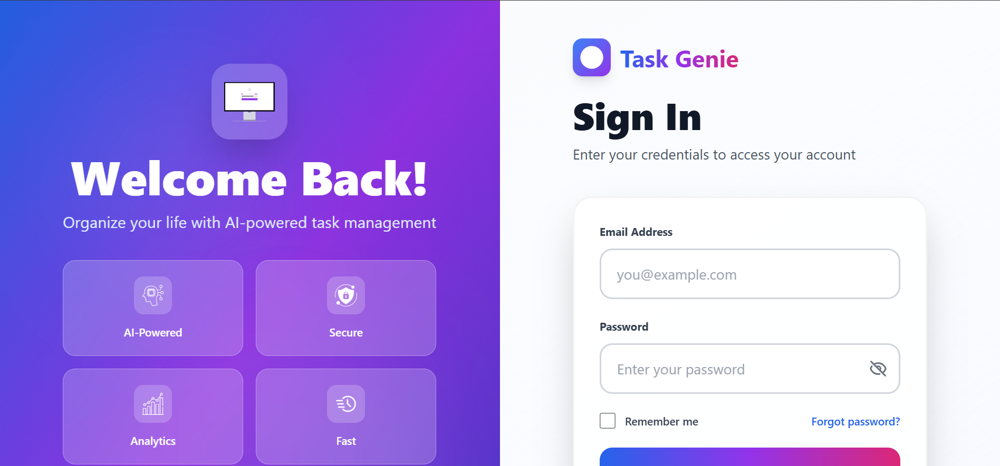
  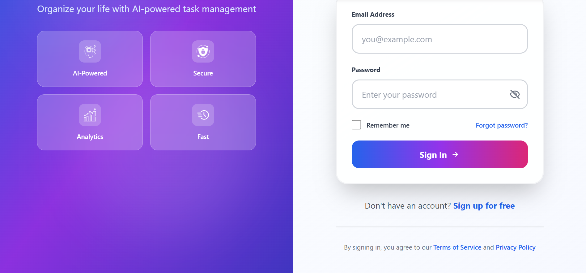
  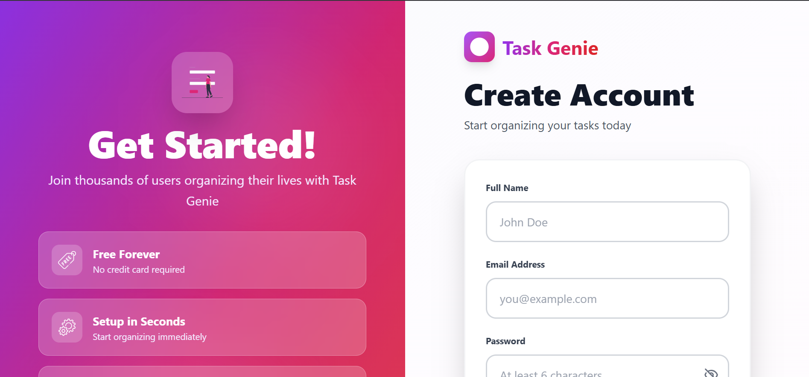
  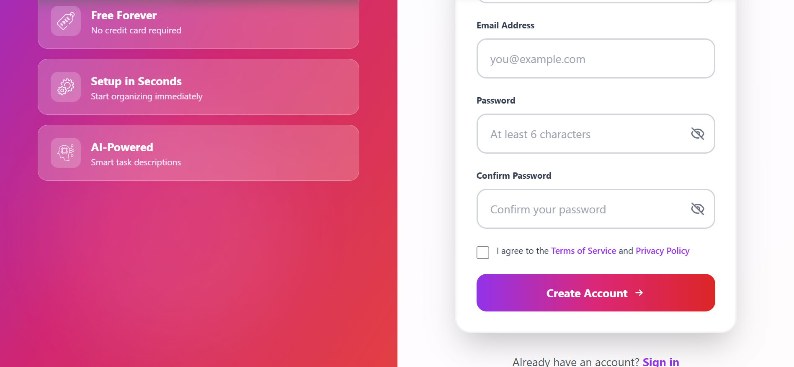

### Landing Page
Beautiful landing page with feature highlights, call-to-action buttons, and modern UI design.

  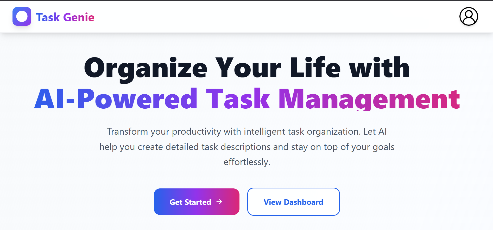
  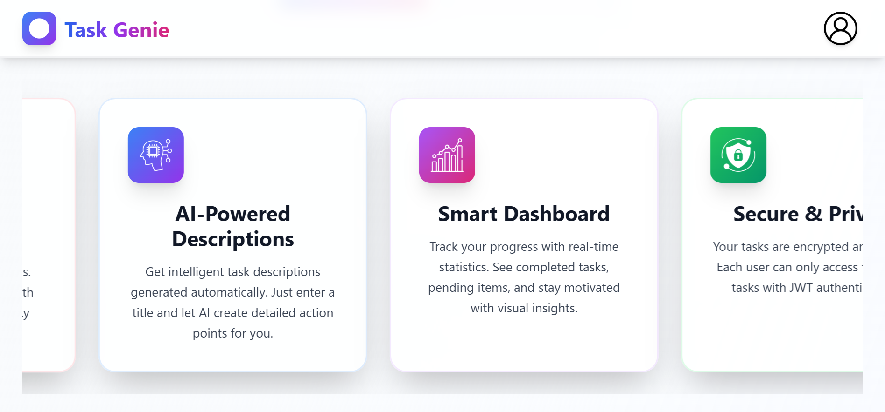
  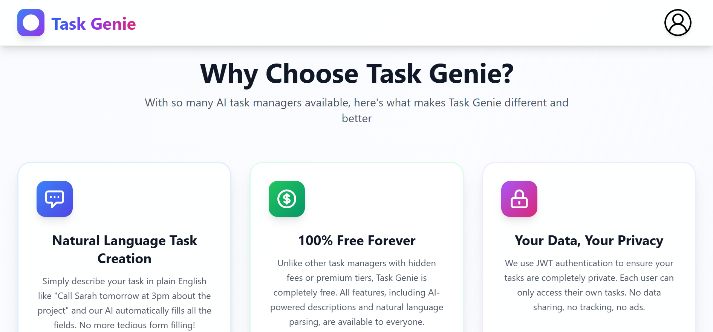
  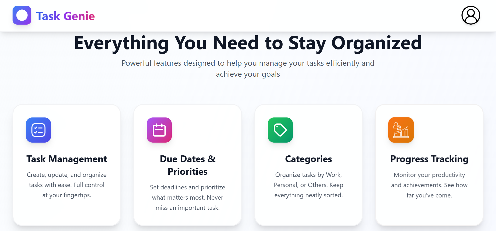
  
  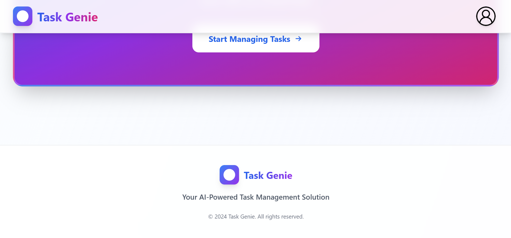

### Dashboard
Interactive dashboard showing task statistics, completion rates, and priority breakdowns.

  
  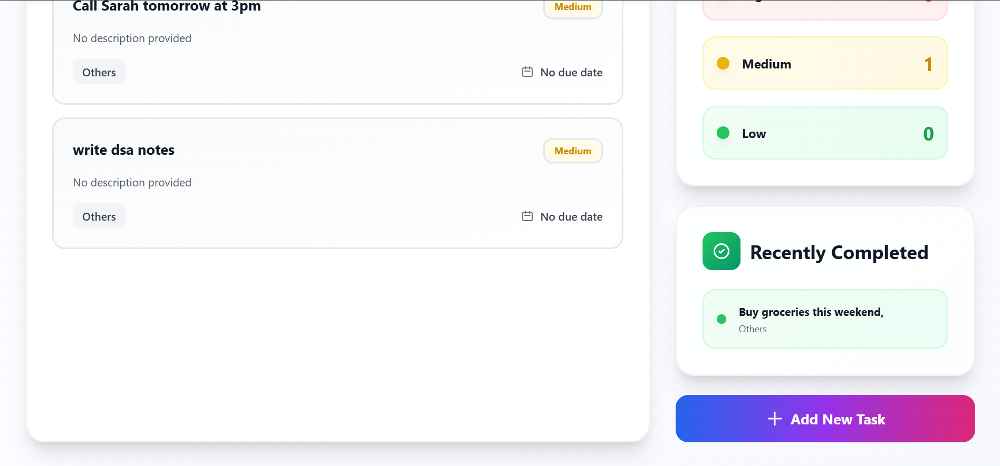

### Task Management
Intuitive task creation and management interface with filtering and sorting options.

  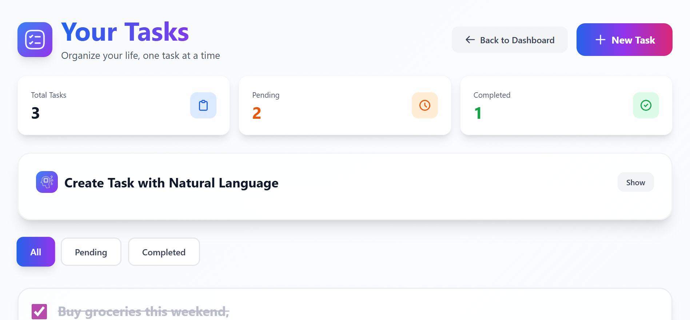
  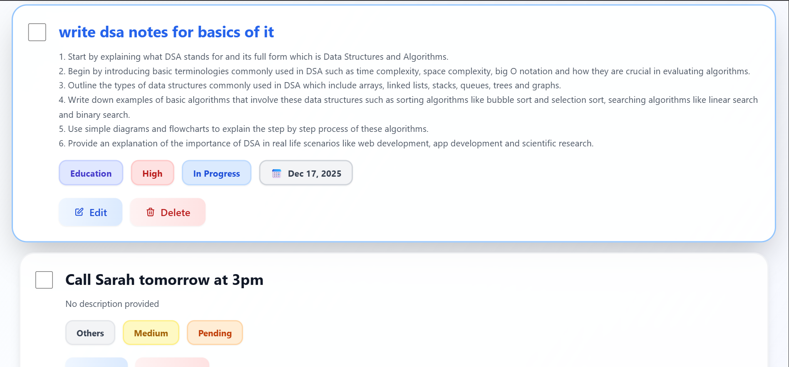

### Natural Language Input
AI-powered task creation using plain English descriptions.

  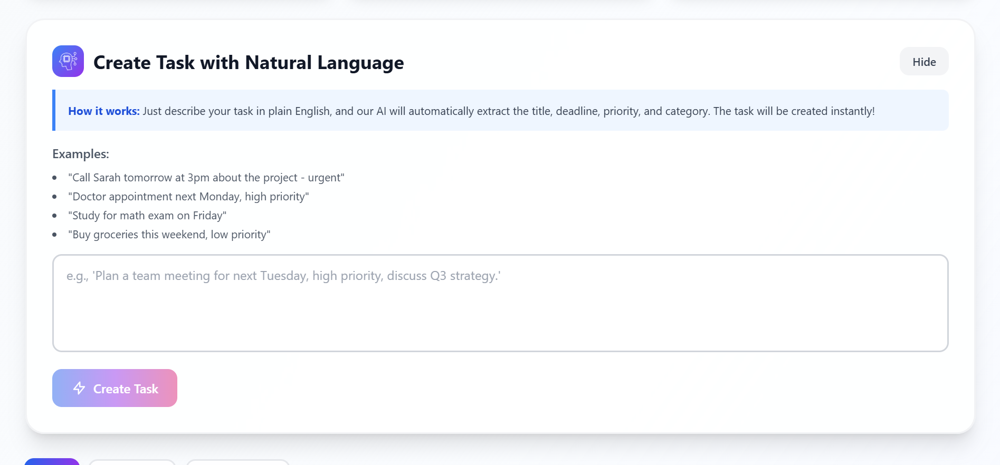

### Edit Profile
User profile management interface with account settings and customization options.

  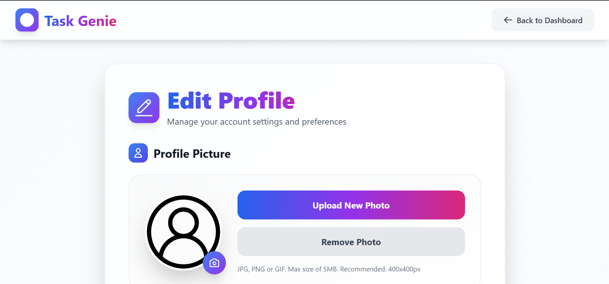
  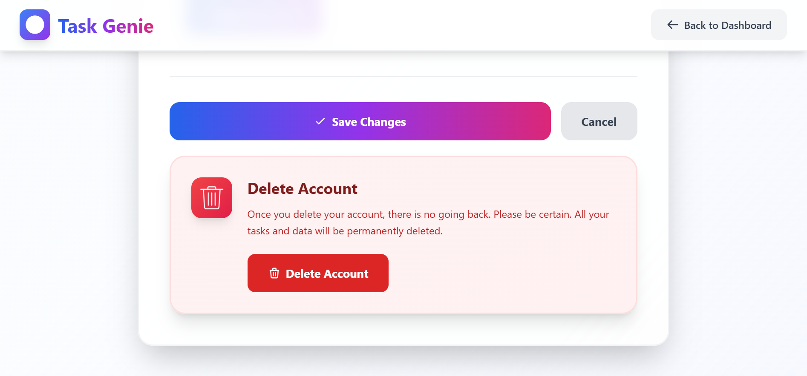

---

## 🔮 Future Work

### Planned Features
- **Mobile Application**: Develop native iOS and Android apps for on-the-go task management
- **Task Templates**: Create and reuse task templates for recurring activities
- **Collaboration Features**: Share tasks with team members and assign responsibilities
- **Calendar Integration**: Sync tasks with Google Calendar, Outlook, and other calendar services
- **Reminder Notifications**: Email and push notifications for upcoming deadlines
- **Task Analytics**: Advanced analytics and insights into productivity patterns
- **Dark Mode**: Toggle between light and dark themes
- **Task Dependencies**: Link related tasks and create task workflows
- **File Attachments**: Attach files and documents to tasks
- **Export/Import**: Export tasks to CSV, PDF, or other formats
- **Multi-language Support**: Support for multiple languages in the UI
- **Voice Input**: Create tasks using voice commands
- **AI Task Suggestions**: Proactive task suggestions based on user behavior
- **Recurring Tasks**: Set up tasks that repeat automatically
- **Task Sharing**: Share individual tasks via links

### Technical Improvements
- **Unit Testing**: Comprehensive test coverage for backend and frontend
- **Integration Testing**: End-to-end testing for critical user flows
- **Performance Optimization**: Database query optimization and caching
- **API Rate Limiting**: Implement rate limiting for API endpoints
- **Error Handling**: Enhanced error handling and user feedback
- **Documentation**: API documentation with Swagger/OpenAPI
- **CI/CD Pipeline**: Automated testing and deployment
- **Docker Support**: Containerization for easy deployment

---

## 📄 License

This project is licensed under the **GNU General Public License v3.0** - see the [LICENSE](LICENSE) file for details.

---

## 👤 Author

**Your Name**
- GitHub: [@likhithaindukuri](https://github.com/likhithaindukuri)
- Email: likhithaindukuri07@gmail.com

---

## ⭐ Show Your Support

If you find this project helpful, please give it a star on GitHub!

---

**Made with ❤️ for better productivity**
